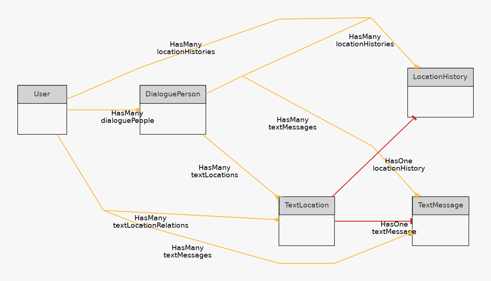

# Data models

In this project the goal is to combine text messages and location history of people in to a readable format.
In order to achieve this, the following models have been created.

## Definitions

### User

Users which login to the application.
Have the ability to access their uploaded data.

### DialoguePerson

An entity which is generated from given information.
Represents an entity which has taken part in a conversation which has been logged.

### TextLocation

This is an abstract/arbitrary link between a location information and a message. 

### LocationHistory

Timestamped location information - where a person has been during a given time.

### TextMessage

Message a person has sent.

### ER graph

